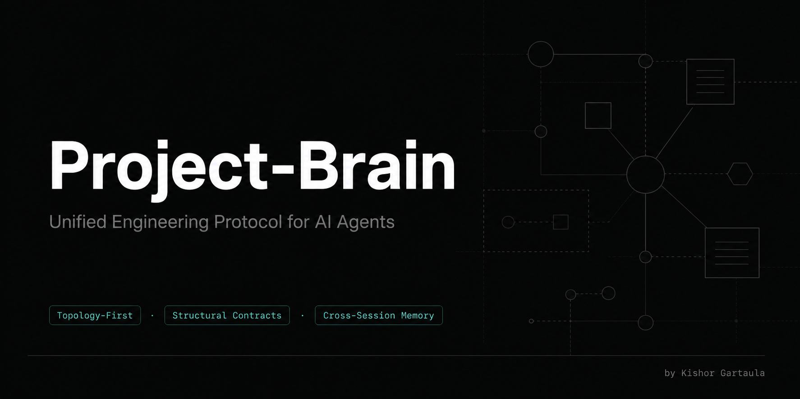

<p align="center">
  
</p>

<h1 align="center">Project-Brain</h1>
<p align="center">
  <strong>A unified AI engineering protocol for complex multi-phase platform builds.</strong><br/>
  Topology-first reasoning · Structural contracts · Cross-session state · Domain file system
</p>

<p align="center">
  <a href="https://github.com/thisiskishor/project-brain/blob/main/LICENSE">
    
  </a>
  
  
</p>

---

## What Problem Does This Solve?

Three failure modes kill complex AI-assisted builds:

| Failure | Symptom | Fix |
|---|---|---|
| **Topology blindness** | AI edits code without knowing what it connects to | Topology Navigation step |
| **Protocol drift** | Each session re-debates locked architectural decisions | AGENTS.md + DECISIONS.md |
| **Context amnesia** | Phase state and error history are lost when a session ends | Progress file + CHANGELOG.md |

Project-Brain v2.0 eliminates all three through a coordinated 4-layer system.

---

## The 4-Layer System

```
Layer 1 — Reasoning Protocol   →  How to think before touching code     (SKILL.md)
Layer 2 — Structural Contracts →  Domain rules + locked decisions        (AGENTS.md hierarchy)
Layer 3 — Living State         →  Phase, what's done, what's next        (project-progress.md)
Layer 4 — Domain Files         →  Specialized truth sources per concern  (DECISIONS, CHANGELOG, ROADMAP, ARCHITECTURE, etc.)
```

- **Layer 1** governs reasoning — topology navigation, verification gates, red lines, ambiguity classification.
- **Layer 2** holds structural contracts — security invariants, phase gates, scope guards, tech stack constraints.
- **Layer 3** holds current state — phase status, active work, open questions, session log (compacted).
- **Layer 4** holds deep domain knowledge — decision history, error records, deferred features, architecture, schema, API catalog, deploy config.

---

## The Domain File System (v2.0 New)

### Core Set — Create for Every Project

| File | Purpose | Mutability |
|------|---------|------------|
| `DECISIONS.md` | Append-only decision registry with reversal tracking | **Append-only** |
| `CHANGELOG.md` | Append-only session history with `MISTAKE/FIX` pattern | **Append-only** |
| `ROADMAP.md` | Living backlog — deferred features, open ideas, explicit out-of-scope | Living |

### Extended Set — Create When Complexity Demands

| File | Create When | Purpose |
|------|-------------|---------|
| `ARCHITECTURE.md` | Non-trivial stack (multiple services, non-obvious patterns) | Single source of truth for all technical decisions |
| `SCHEMA.md` | DB has > ~10 tables | Human-readable ER map, relationships, key invariants |
| `API.md` | Routes > ~20 | Living API catalog with build status tracking |
| `DEPLOYMENT.md` | Multi-project machine or complex deploy pipeline | Git identity rules, deploy config, credentials guide |

### Two Organization Patterns

**Pattern A — Centralized** (monorepos, Next.js, single-codebase): all files in `Project Brain/` folder.

**Pattern B — Distributed** (multi-service, separated repos): root files + child `AGENTS.md` per service directory.

---

## The File Load Map

The most important operational rule. **Do not load every file on every session.**

```
ALWAYS:  project-progress.md + AGENTS.md

L1 (typo, config):           stop here
L2 (new feature/endpoint):   + ARCHITECTURE.md (relevant section)
L3 (DB/schema change):       + ARCHITECTURE.md (full) + SCHEMA.md
L4 (auth/payments/phase):    + ARCHITECTURE.md + ROADMAP.md + DECISIONS.md

API work:                    + API.md
Deploy/git work:             + DEPLOYMENT.md
History debugging:           + CHANGELOG.md  ← never load routinely
```

Loading everything on every session wastes 2,000–4,000 tokens per session on a large project. The load map eliminates that waste.

---

## How to Install

### Option A — Claude Code Skills Directory

```bash
# Copy the skill folder into your Claude skills directory
cp -r project-brain ~/.claude/skills/project-brain

# Or on Windows
xcopy /E /I project-brain "%USERPROFILE%\.claude\skills\project-brain"
```

### Option B — Drop into Any Project

Copy `project-brain/SKILL.md` into your project root or reference it from your `CLAUDE.md`:

```markdown
@import ./project-brain/SKILL.md
```

### Option C — Direct Import in AGENTS.md or CLAUDE.md

Reference the skill by path. The agent will load the protocol rules at session start.

---

## How to Use

### Initialize a New Project

```
Tell your agent: "Initialize project-brain for this project."
```

The agent will:
1. Create `AGENTS.md` at the project root
2. Create `project-progress.md`
3. Create `DECISIONS.md`, `CHANGELOG.md`, and `ROADMAP.md`
4. Assess complexity and create extended files as warranted (ARCHITECTURE.md, SCHEMA.md, API.md, DEPLOYMENT.md)
5. Apply the 4-layer system from the first session forward

### Start a Session on an Existing Project

```
Tell your agent: "Read AGENTS.md and project-progress.md. Apply the project-brain protocol."
```

### On Session End

```
Tell your agent: "Close session. Update project-brain state."
```

The agent will:
- Update `project-progress.md` (compact session log if > 5 entries)
- Append to `CHANGELOG.md`
- Append any new decisions to `DECISIONS.md`
- Update `ROADMAP.md` if features moved phases
- Update `AGENTS.md` only if structural contracts changed

---

## Repository Structure

```
project-brain/
├── README.md                        ← you are here
├── CHANGELOG.md                     ← version history
├── CONTRIBUTING.md                  ← how to contribute
├── LICENSE                          ← MIT License
├── NOTICE.md                        ← attribution requirements
├── assets/
│   └── banner.png
├── project-brain/
│   ├── SKILL.md                     ← main protocol (v2.0)
│   └── references/
│       ├── token-guide.md           ← token cost estimates + load path reference
│       └── templates/
│           ├── root-agents-template.md        ← root AGENTS.md
│           ├── child-agents-template.md       ← child AGENTS.md (Pattern B)
│           ├── progress-file-template.md      ← project-progress.md
│           ├── decisions-template.md          ← DECISIONS.md (NEW in v2.0)
│           ├── changelog-template.md          ← CHANGELOG.md (NEW in v2.0)
│           ├── roadmap-template.md            ← ROADMAP.md (NEW in v2.0)
│           ├── architecture-template.md       ← ARCHITECTURE.md (NEW in v2.0)
│           └── history-archive-template.md    ← .project/history.md
└── examples/
    └── example-project/
        ├── AGENTS.md                ← fully populated root AGENTS.md
        ├── project-progress.md      ← fully populated progress file
        ├── DECISIONS.md             ← fully populated decision registry (NEW)
        ├── CHANGELOG.md             ← fully populated changelog (NEW)
        ├── ROADMAP.md               ← fully populated roadmap (NEW)
        └── .project/
            └── history.md           ← example archived session log
```

---

## Compatibility

Works with any AI agent that reads SKILL.md, AGENTS.md, or CLAUDE.md files:

| Agent | How to load |
|-------|------------|
| **Claude Code** | Install to `~/.claude/skills/` or import via `@import` in CLAUDE.md |
| **Cursor** | Add SKILL.md contents to `.cursor/rules` or reference in project rules |
| **OpenAI Codex** | Place SKILL.md in project root alongside AGENTS.md |
| **Windsurf** | Add to `.windsurfrules` or import SKILL.md |
| **GitHub Copilot** | Reference in `.github/copilot-instructions.md` |
| **Cline / RooCode** | Load via system prompt or `.clinerules` |

---

## What's in SKILL.md v2.0

- **4-Layer System** — added Layer 4: Domain Files
- **Domain File System** — Core Set (DECISIONS, CHANGELOG, ROADMAP) + Extended Set (ARCHITECTURE, SCHEMA, API, DEPLOYMENT)
- **File Load Map** — explicit L1/L2/L3/L4 load paths with specific files per level; replaces vague "lazy-read" guidance
- **Two Organization Patterns** — Pattern A (centralized monorepo) vs. Pattern B (distributed multi-service)
- **Ambiguity Classification** — 4 levels (Trivial → High) with clear action per level
- **Topology Navigation** — map data flows, call graphs, and invariants before editing
- **The 5 Invariables** — state, observability, coupling, timing, idempotency
- **Verification Gate** — 7-point pre-code checklist
- **Red Lines** — hard stops requiring explicit user sign-off
- **AGENTS.md Chain Protocol** — lazy-read on session start, deferred-write on session end
- **Domain File Update Rules** — when and how to update each domain file on CLOSE
- **Commit Decision Framework** — Full Coherence / Pragmatic Partial / Hold + Clarify / User Override
- **Session Log Compaction** — cap at 5 entries, archive to `.project/history.md`
- **Session Complexity Levels** — L1–L4 with load map and protocol per level

---

## What Changed in v2.0

| v1.x | v2.0 |
|------|------|
| 2-file core (AGENTS.md + progress.md) | 5-file core + 4 optional extended files |
| "Lazy-read rule" (general guidance) | Explicit File Load Map with L1/L2/L3/L4 + file names |
| No decision history | DECISIONS.md — append-only registry with reversal tracking |
| No error history | CHANGELOG.md — append-only with MISTAKE/FIX pattern |
| No deferred feature tracking | ROADMAP.md — living backlog and scope guard |
| No architecture file | ARCHITECTURE.md template — single source of truth |
| Locked decisions duplicated in progress.md | Stripped from progress.md — canonical source is DECISIONS.md |
| Child AGENTS.md as primary pattern | Two patterns: A (centralized) for monorepos, B (distributed) for multi-service |

---

## Who This Is For

- Solo developers building complex multi-phase platforms (auth + payments + maps + real-time)
- Teams where multiple agents or developers work on the same codebase across sessions
- Projects with hard architectural invariants (payment splits, RLS security, commission logic)
- Anyone tired of re-explaining locked decisions every new session
- Any build where "what went wrong last time" needs to survive context resets

---

## Author

**Kishor Gartaula**
- GitHub: [https://github.com/thisiskishor](https://github.com/thisiskishor)
- Website: [https://kishorgartaula.com.np](https://kishorgartaula.com.np)

---

## License

MIT License — see [LICENSE](./LICENSE) for full terms.

If you modify and redistribute this skill, see [NOTICE.md](./NOTICE.md) for attribution requirements.

---

## Related Skills

- [code-brain](https://github.com/thisiskishor/code-brain) — persistent session memory system for Claude (pairs well with project-brain)
